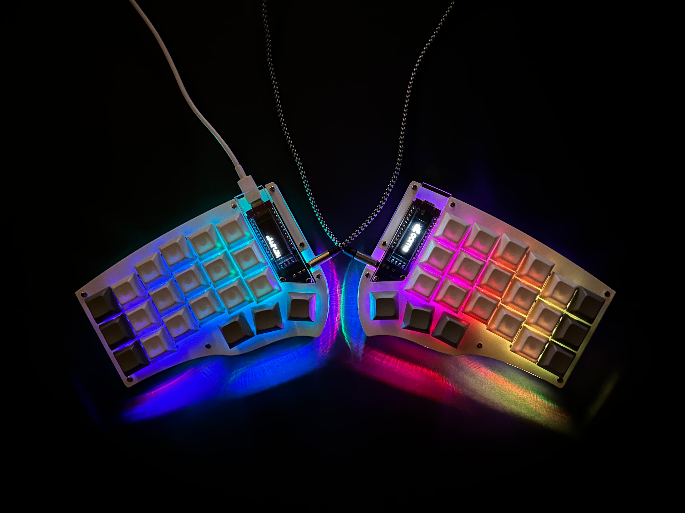
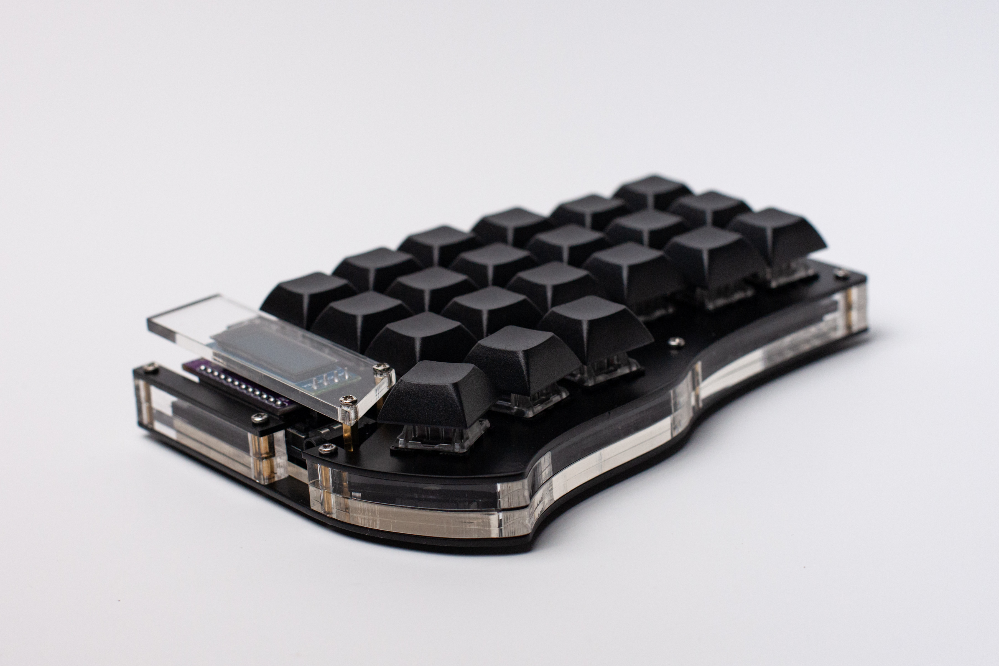

# Collection of full body (stacked) cases
All cases consists of three plates which gives the keyboard more solid look.  
Additionaly there is an acrylic stands to make them tentable for more comfortable typing experience.
    

### Suggested BOM:  
- Top and bottom plates - 3mm acrylic
- Middle plate - 5mm/6mm/2x3mm acrylic
- 10 M2 standoff spacers 5mm/6mm - should be the same length as the middle plates
- 28 M2 5mm screws
- Stands for tenting - 5mm acrylic 
- 4 M2 20mm screws for six 5mm acrylic stands (they're should be stacked)
- 12 3M Bumpons
- For display cover you will need 4 M2 standoff spacers with the length according to your build.  
