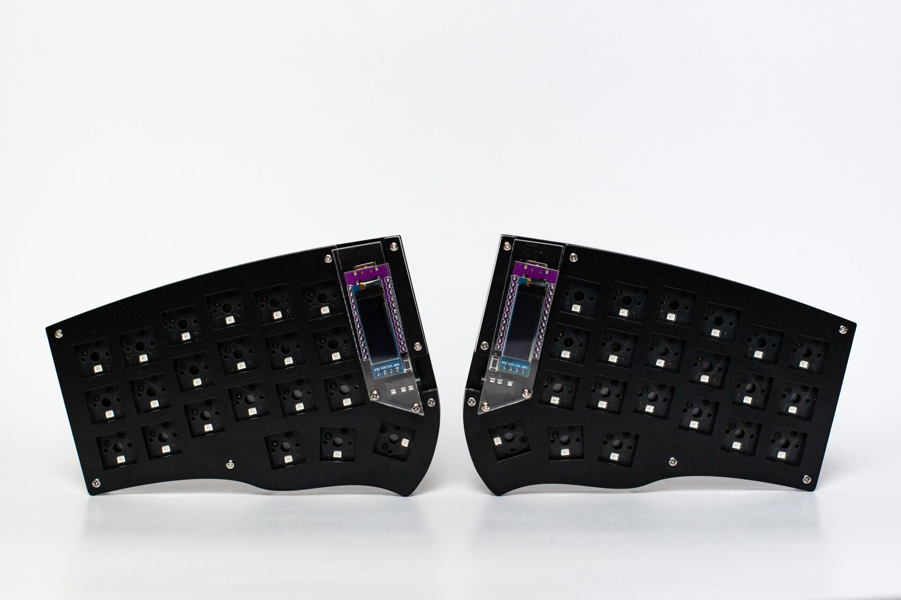
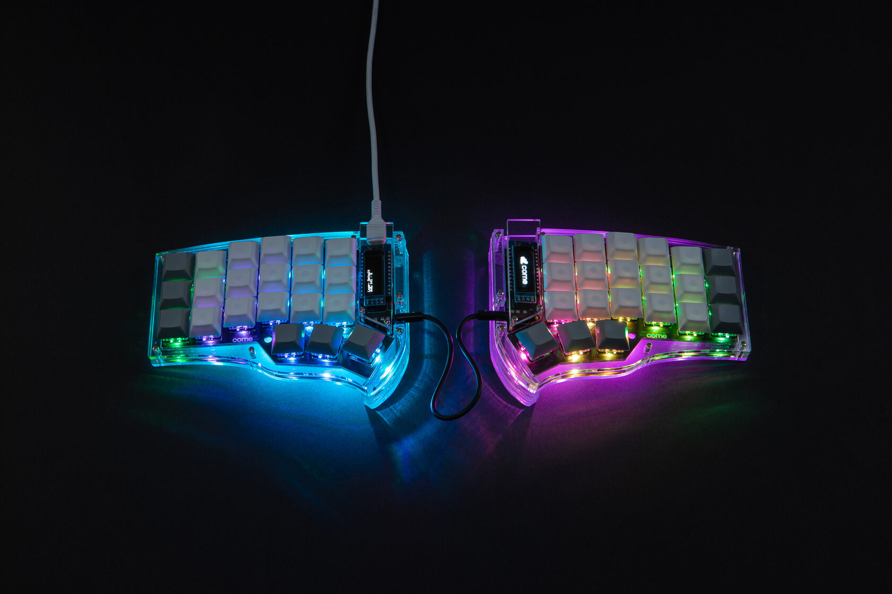
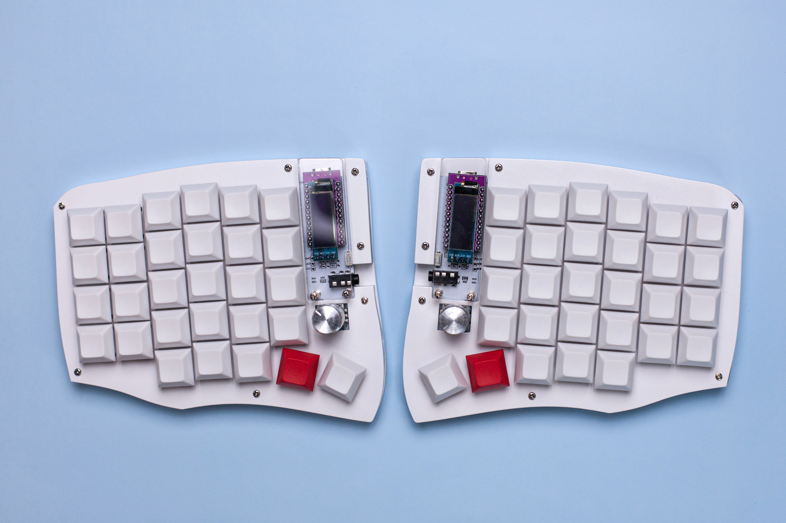

# Collection of full body (stacked) cases
All cases consist of three plates which gives the keyboard a more solid look.
Additionally there are acrylic stands to make the halves tentable for a more comfortable typing experience.
    

### Suggested BOM:  
- Top and bottom plates - 3mm acrylic
- Middle plate - 5mm/6mm/2x3mm acrylic
- 10 M2 standoff spacers 5mm/6mm - should be the same length as the middle plates
- 28 M2 5mm screws
- Stands for tenting - 5mm acrylic 
- 4 M2 20mm screws for six 5mm acrylic stands (they're should be stacked)
- 12 3M Bumpons
- For display cover you will need 4 M2 standoff spacers with the length according to your build.  
